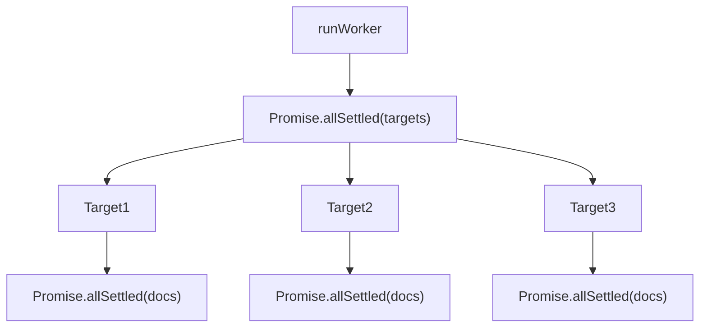
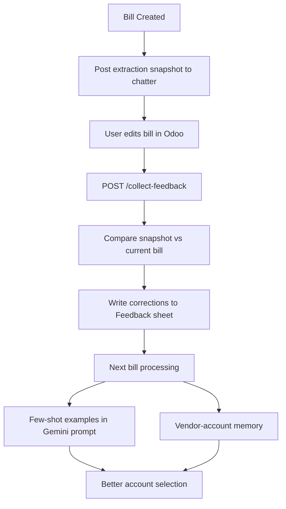

# Parallel Processing + Feedback Learning Loop

Two independent improvements merged into one plan. Parallelization is prerequisite-free and can ship first; the feedback loop builds on top.

---

## Part A: Parallelize Worker Processing

Currently `runWorker` processes targets sequentially and `processTargetGroup` processes documents sequentially. Both become fully concurrent.




### A1. `runWorker` in [src/worker.js](src/worker.js) (~line 2117)

- Replace `for (const target of targets)` with `Promise.allSettled(targets.map(t => processTargetGroup(t, startMs, logger)))`
- Warm `accountMappingCache` before fan-out by calling `getAccountMapping()` once upfront
- Aggregate stats from settled results after all resolve

### A2. `processTargetGroup` in [src/worker.js](src/worker.js) (~line 1883)

- Replace `for (const doc of docsSorted)` with `Promise.allSettled(docsSorted.map(...))`
- Compute `lastDocId` as `Math.max(...docIds)` from settled results
- Call `saveState` once after all docs settle

### A3. Cache safety

Module-level caches (`expenseAccountsCache`, `vendorAccountCache`, `documentFieldSupportCache`) are keyed Maps with idempotent writes -- safe as-is for concurrency. Warm `accountMappingCache` (single global value) before fan-out.

### A4. No changes to

- `isRunning` mutex in [src/server.js](src/server.js) (still one `/run` at a time)
- `run-one` endpoint (single document, unaffected)
- `clearPerRunCaches()` at start of `runWorker`

---

## Part B: Feedback Learning Loop




### B1. Capture Extraction Snapshot (Phase 1)

After bill creation in `processOneDocument` ([src/worker.js](src/worker.js) ~line 1727), post a machine-readable chatter note:

```
<!--SNAPSHOT_V1:{"partner_id":33,"vendor_name":"...","lines":[{"account_id":104,"account_code":"511100","price_unit":1250,"quantity":1,"description":"...","resolution_source":"gemini"}],"grand_total":9200,"industry":"Food and Beverage","doc_id":355}-->
```

### B2. Collect Feedback Endpoint (Phase 2)

New `POST /collect-feedback` route in [src/server.js](src/server.js) and `collectFeedback()` in [src/worker.js](src/worker.js):

- Query Odoo for worker-created bills (last N days, identified by snapshot marker)
- Read current `account.move` + `account.move.line` state
- Parse snapshot, diff against current: account changes, amount changes, vendor changes, lines added/removed
- Write corrections to a **Feedback** Google Sheet tab

**Feedback sheet columns:** `timestamp`, `doc_id`, `bill_id`, `target_db`, `company_id`, `industry`, `vendor_name`, `vendor_changed`, `new_vendor_name`, `line_index`, `item_description`, `original_account_code`, `original_account_name`, `corrected_account_code`, `corrected_account_name`, `original_amount`, `corrected_amount`, `correction_type`

### B3. Inject Corrections into Gemini Prompt (Phase 3)

Extend `assignAccountsWithGemini` in [src/gemini.js](src/gemini.js):

- New `loadFeedbackCorrections(config, companyId, industry)` in [src/sheets.js](src/sheets.js) reads the Feedback sheet, filters by company/industry, returns most recent N corrections
- Inject as few-shot examples before the RULES section:

```
LEARNED FROM PAST CORRECTIONS (follow the same pattern):
- "Pork Belly" from "BMR FROZEN MEATS" was corrected: "620000 Admin Expense" -> "511100 COGS - Purchases"
```

### B4. Vendor-Account Memory (Phase 4)

New sheet tab **VendorAccountMemory**: `vendor_name_pattern`, `company_id`, `account_code`, `account_name`, `confidence`, `correction_count`, `last_updated`

- Auto-populated by `collectFeedback` when 3+ corrections point to the same account for a vendor
- New resolution tier in `resolveExpenseAccountId` between Tier 1 (vendor default) and Tier 2 (Gemini)

### B5. Files to change

- [src/worker.js](src/worker.js) -- snapshot posting, `collectFeedback()`, VendorAccountMemory tier
- [src/gemini.js](src/gemini.js) -- inject historical corrections into account assignment prompt
- [src/sheets.js](src/sheets.js) -- `loadFeedbackCorrections()`, `saveFeedbackRows()`, `loadVendorAccountMemory()`, `saveVendorAccountMemory()`
- [src/server.js](src/server.js) -- `POST /collect-feedback` route
- [src/config.js](src/config.js) -- `FEEDBACK_SHEET_NAME`, `VENDOR_MEMORY_SHEET_NAME`, `FEEDBACK_LOOKBACK_DAYS` env vars
- [cloudrun.env.yaml](cloudrun.env.yaml) -- new env vars

