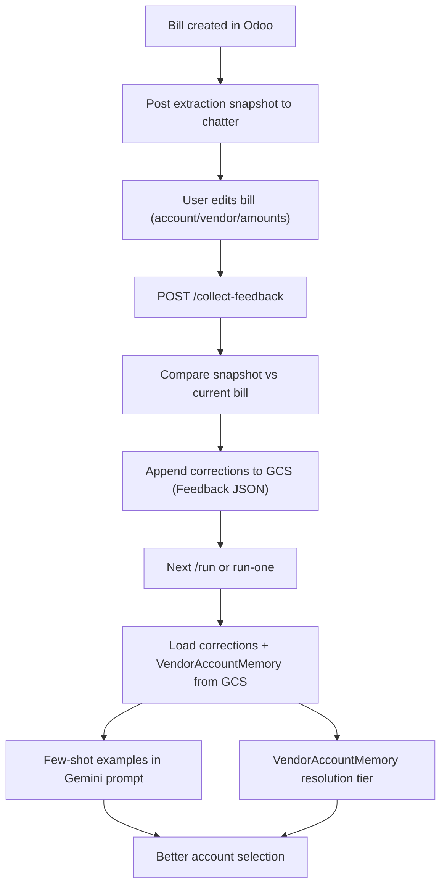

# Self-Learning Feedback Loop — Implementation Plan

**Direction: move away from Google Sheets.**

- **Single source of truth for config = Odoo.** All configuration (routing, accounting IDs, enabled flags, credentials) lives in **source Odoo** (General task / project.task). No config is authored in GCS or Sheets.
- **Caching = Cloud Storage (GCS).** GCS is used for **cache and derived data**: optional cache of config for faster worker reads; Feedback (corrections) and VendorAccountMemory as cache of learned data. Worker can read config from Odoo and optionally write a cache to GCS for the next run, or read config from Odoo only.

Improve account assignment over time by capturing what the worker did, detecting when users correct bills in Odoo, and reusing those corrections (stored in GCS cache) as few-shot examples and vendor-account memory.

---

## List of commands (API endpoints)

**After building** (when you implement a new endpoint), update: (1) this table — add the route and mark it implemented; (2) the `routes` array in **src/server.js** `GET /` so the running service advertises all available routes.


| Method | Path                       | Auth   | Status      | Description                                                                        |
| ------ | -------------------------- | ------ | ----------- | ---------------------------------------------------------------------------------- |
| GET    | `/`                        | no     | implemented | Service info and list of routes                                                    |
| GET    | `/health`                  | no     | implemented | Health check                                                                       |
| GET    | `/healthz`                 | no     | implemented | Health check (e.g. for Cloud Run)                                                  |
| GET    | `/list-docs`               | secret | implemented | List AP documents for a target (`?target_key=...`)                                 |
| POST   | `/debug`                   | secret | implemented | Debug routing and target Odoo connectivity                                         |
| GET    | `/run`                     | secret | implemented | Run full worker (all targets, batch)                                               |
| POST   | `/run`                     | secret | implemented | Run full worker (optional body)                                                    |
| POST   | `/run-one`                 | secret | implemented | Process one document; body: `doc_id` and/or `attachment_id`, optional `target_key` |
| POST   | `/collect-feedback`        | secret | implemented | Compare snapshot vs current bills, append corrections to GCS                       |
| POST   | `/webhook/document-upload` | secret | implemented | On upload notification → run-one for that document (create draft bill)             |
| POST   | `/webhook/document-delete` | secret | implemented | On document delete → delete the draft bill created from that document              |


Auth: “secret” = header `x-worker-secret` (or `WORKER_SHARED_SECRET`). Localhost is often allowed without secret.

---

## Part A: Odoo = config (single source of truth); GCS = cache

### A1. Routing from General task (project.task)

**Source of targets:** the worker no longer reads from the ProjectRouting sheet. Instead it gets “targets” from the **source Odoo** instance by querying **project.task** (General tasks), filtered by stage (e.g. `x_studio_accounting_database` set and stage = General / configurable).

**General task fields (already exist):**


| Field                                  | Purpose                                                                                                                                    |
| -------------------------------------- | ------------------------------------------------------------------------------------------------------------------------------------------ |
| `x_studio_industry`                    | Industry for the project (e.g. for Gemini / feedback filtering).                                                                           |
| `x_studio_accounting_database`         | Target DB name for this project.                                                                                                           |
| `x_studio_multi_company`               | Boolean: if true, use `x_studio_company_id_if_multi_company` as target company id; if false, use default company (e.g. 0 or main company). |
| `x_studio_company_id_if_multi_company` | Target company id when `x_studio_multi_company` is true.                                                                                   |
| `x_studio_enabled`                     | If true, project is enabled for processing.                                                                                                |
| `x_studio_email`                       | Target user/email (for display or auth context if needed).                                                                                 |
| `x_studio_api_key`                     | Target API key (used for authenticating to the **target** Odoo for this project).                                                          |
| `x_studio_odoo_bill_worker`            | **Run condition:** worker runs for this project only when this is true (in addition to `x_studio_enabled`).                                |


**Worker run condition for a project:** include a project in the targets list only when:

- `x_studio_enabled` is true, and  
- `x_studio_odoo_bill_worker` is true, and  
- Required fields are present: `x_studio_accounting_database`, target company id (from multi_company logic), and credentials (e.g. API key or login/password as configured).

**Implementation:** Replace `getRoutingRows` / `groupRoutingRows` flow that reads from Sheets with a new path that uses the source Odoo connection to `search_read` project.task with the right domain (stage, enabled, odoo_bill_worker). Map each task to the same “target” shape the worker already uses (target_base_url, target_db, target_company_id, target_login/target_password or api_key, industry, etc.).

### A2. Accounting config: single source of truth in Odoo; optional cache in GCS

**Config lives in Odoo.** Store the five accounting IDs on the **General task (project.task)** (or a related config model) so Odoo is the single source of truth. Fields: `x_studio_ap_folder_id`, `x_studio_purchase_journal_id`, `x_studio_vat_purchase_tax_id_goods`, `x_studio_vat_purchase_tax_id_services`, `x_studio_vat_purchase_tax_id_generic` (or equivalent). Worker reads targets from Odoo and **reads accounting config from Odoo** (same task record).

**Optional cache in GCS:** To reduce Odoo read load or latency, the worker can **cache** the resolved config per target in GCS (e.g. `{accountingConfigPrefix}/{targetKey}.json`). On each run: try cache first (if valid/TTL ok), else read from Odoo and write cache. Config is always authoritative in Odoo; GCS is a cache only.

**Cache is not updated instantly** when someone changes config in Odoo. It is refreshed only when the worker runs and decides to read from Odoo (e.g. cache miss or TTL expired). To keep changes visible quickly: use a short TTL (e.g. 5–15 minutes), or skip cache and always read config from Odoo; for instant invalidation you’d need something that writes to GCS when Odoo config is saved (e.g. Odoo automation or a small service).

### A3. Feedback and VendorAccountMemory in Cloud Storage (GCS)

**Feedback** and **VendorAccountMemory** are stored in **GCS as JSON** (no Odoo custom models).

- **Feedback:** One JSON file (e.g. `{feedbackPrefix}/feedback.json`) containing an **array** of correction objects. Each object: `timestamp`, `doc_id`, `bill_id`, `target_db`, `company_id`, `industry`, `vendor_name`, `vendor_changed`, `new_vendor_name`, `line_index`, `item_description`, `original_account_code`, `original_account_name`, `corrected_account_code`, `corrected_account_name`, `original_amount`, `corrected_amount`, `correction_type` (optionally `source_project_id`). **Append** new corrections (read file, parse JSON array, push new rows, write back). Use a prefix like `config.gcs.feedbackPrefix` (e.g. `AP_FEEDBACK_V1`). Optionally one file per company/target to avoid large single file: `feedback/{targetKey}.json`.
- **VendorAccountMemory:** One JSON file (e.g. `{vendorMemoryPrefix}/vendor_memory.json`) containing an **array** of entries: `vendor_name_pattern`, `company_id`, `account_code`, `account_name`, `confidence`, `correction_count`, `last_updated`. **Read-modify-write** when updating from collectFeedback (aggregate by vendor+company+account, then merge into the array and write). Use prefix like `config.gcs.vendorMemoryPrefix` (e.g. `AP_VENDOR_MEMORY_V1`). Optionally one file per company: `vendor_memory/{companyId}.json`.

Reuse [src/gcs.js](src/gcs.js) and the same bucket as state (`config.gcs.stateBucket`) or a dedicated bucket. No Odoo dependency for feedback or memory.

**Multi-database (per-target) isolation:** Feedback and VendorAccountMemory are keyed by **target_key** (the unique routing target identifier), not by `company_id`. So each target database has its own logical “memory”: corrections and vendor-account rules from DB A never affect DB B. All rows include `target_key`; `loadFeedbackCorrections(targetKey, industry)` and `loadVendorAccountMemory(targetKey)` filter by it.

### Firestore vs Cloud Storage (for cache / feedback / vendor memory)

**What is Firestore?** Google Cloud’s document (NoSQL) database. Data is stored in **collections** of **documents** (JSON-like). You can query by field, use indexes, and subscribe to real-time updates. Suited to many small, structured records and low-latency reads/writes.

**Is Firestore faster than Cloud Storage?** For **small, frequent reads/writes and querying**, Firestore is usually **faster and more flexible**:

- **Latency:** Firestore single-document read/write is often in the single-digit to low tens of ms. Cloud Storage get/put is object-based; small-object latency is often higher (e.g. 20–50 ms or more) and you always read/write the whole object.
- **Queries:** Firestore supports queries (e.g. “all corrections for company_id = X, ordered by timestamp”). With GCS you typically read one or more whole JSON files and filter in memory.
- **Updates:** Firestore supports partial updates (update one field). GCS requires read full object → modify → write.

**When to use which:**

- **Cloud Storage (GCS):** Simpler, no extra product; you already use it for state. Good for append-only or bulk read/write (e.g. one big Feedback JSON array per target), and when you don’t need query-by-field or real-time. Cheaper for large blobs.
- **Firestore:** Better when you need low-latency, many small documents, or querying (e.g. “last N corrections for company X”). Adds a separate API and billing model.

**Recommendation for this instance: use Cloud Storage (GCS).** The worker already uses GCS for run state (`STATE_BUCKET`); reusing it for config cache, Feedback, and VendorAccountMemory keeps one storage system, one auth model, and no extra product. Volume and read frequency are modest (scheduled or on-demand runs), so the latency difference between GCS and Firestore is unlikely to matter. Prefer Firestore only if you later need query-by-field at scale, very large Feedback sets with frequent updates, or real-time access from another service.

---

## Part B: Self-learning feedback loop (GCS-backed)

---

## Overview




---

## Phase 1: Capture snapshot (B1)

**Goal:** After each bill is created, post a machine-readable snapshot to that bill’s chatter so we can later diff “what the worker did” vs “what the user left”.

### B1.1 Where to change

- **File:** [src/worker.js](src/worker.js)
- **Location:** After bill creation and existing chatter messages, before `return { status: "ok", billId, ... }` in `processOneDocument` (~after line 1967, before 1979). Bill is created at ~1896; messages at 1936, 1955, 1967.

### B1.2 Snapshot format

Post a single chatter message (e.g. via `safeMessagePost`) whose body is an HTML comment so it doesn’t clutter the UI:

```
<!--SNAPSHOT_V1:{"partner_id":33,"vendor_name":"BMR FROZEN MEATS","lines":[{"account_id":104,"account_code":"511100","account_name":"COGS - Purchases","price_unit":1250,"quantity":1,"description":"Pork Belly","resolution_source":"gemini"}],"grand_total":9200,"industry":"Food and Beverage","doc_id":355}-->
```

**Fields to include in JSON:**


| Field         | Source                                                                                                                                            |
| ------------- | ------------------------------------------------------------------------------------------------------------------------------------------------- |
| `partner_id`  | `vendor.id`                                                                                                                                       |
| `vendor_name` | `vendor.name`                                                                                                                                     |
| `lines`       | Array of `{ account_id, account_code, account_name, price_unit, quantity, description, resolution_source }` from the lines used to build the bill |
| `grand_total` | From extracted / corrected total used for the bill                                                                                                |
| `industry`    | From target/company context                                                                                                                       |
| `doc_id`      | `doc.id`                                                                                                                                          |


Add a small helper to build the JSON and wrap it in `<!--SNAPSHOT_V1:...-->`, then call `safeMessagePost(odoo, companyId, "account.move", billId, snapshotHtml)`.

### B1.3 Acceptance

- After a run that creates a bill, the bill’s chatter contains exactly one message with `<!--SNAPSHOT_V1:` and valid JSON.
- Parsing that JSON yields `partner_id`, `vendor_name`, `lines[]`, `grand_total`, `industry`, `doc_id`.

---

## Phase 1b: Config for feedback (B1b)

**Goal:** Centralize lookback and GCS prefixes for feedback and vendor memory (and accounting config). No Google Sheets for feedback/memory.

### B1b.1 Changes

- **File:** [src/config.js](src/config.js)  
Add under `config.gcs` (or a `feedback` section):
  - `feedbackLookbackDays: toInt(process.env.FEEDBACK_LOOKBACK_DAYS, 14)`
  - `feedbackPrefix: process.env.GCS_FEEDBACK_PREFIX || "AP_FEEDBACK_V1"`
  - `vendorMemoryPrefix: process.env.GCS_VENDOR_MEMORY_PREFIX || "AP_VENDOR_MEMORY_V1"`
  - `accountingConfigPrefix: process.env.GCS_ACCOUNTING_CONFIG_PREFIX || "AP_ACCOUNTING_CONFIG"`
  (Bucket: reuse `stateBucket` or add a dedicated bucket env if desired.)
- **File:** [cloudrun.env.yaml](cloudrun.env.yaml) (or `.env.example`)  
Document: `FEEDBACK_LOOKBACK_DAYS`, `GCS_FEEDBACK_PREFIX`, `GCS_VENDOR_MEMORY_PREFIX`, `GCS_ACCOUNTING_CONFIG_PREFIX`.

### B1b.2 Acceptance

- Config exports lookback and GCS prefixes; worker and collect-feedback use GCS for feedback/memory and accounting config.

---

## Phase 2: Collect feedback (B2)

**Goal:** New endpoint that finds bills with snapshots, diffs snapshot vs current state, and **appends** correction records to the **Feedback JSON file in GCS**.

### B2a. Endpoint and entrypoint (B2a)

- **File:** [src/server.js](src/server.js)  
Add `POST /collect-feedback` (protected by same auth as `/run` if applicable). Handler calls `collectFeedback(config, logger)` and returns summary (e.g. bills scanned, corrections written).
- **File:** [src/worker.js](src/worker.js)  
Add `async function collectFeedback(config, logger)`. High-level steps:
  1. Get targets from **Odoo** (General tasks with x_studio_enabled and x_studio_odoo_bill_worker; see Part A).
  2. For each target, get **target** Odoo client and company id; search `account.move` for bills that have a chatter message containing `SNAPSHOT_V1` and creation date within last `config.feedbackLookbackDays`.
  3. For each such bill: get move + move lines, find snapshot message, parse JSON, diff (see B2b), **append** correction objects to the Feedback JSON in GCS (B2c). Optionally update VendorAccountMemory in GCS when 3+ same correction.

### B2b. Diff logic (B2b)

- **File:** [src/worker.js](src/worker.js) (e.g. in `collectFeedback` or a helper `diffSnapshotVsBill(snapshot, move, moveLines)`).

Compare snapshot vs current:

- **Account change (per line):** snapshot line `account_code` / `account_id` ≠ current move line account → one correction row with `correction_type: "account"`.
- **Amount change (per line):** snapshot `price_unit`/`quantity` vs current → if different, row with `correction_type: "amount"`.
- **Vendor change:** snapshot `partner_id` vs move `partner_id` → one row with `vendor_changed: true`, `new_vendor_name` from current partner.
- **Lines added/removed:** snapshot `lines.length` vs current line count; optional: rows for “line added” / “line removed” if you want to track structural edits.

**Feedback record shape (JSON object per correction):**

`timestamp`, `doc_id`, `bill_id`, `target_db`, `company_id`, `industry`, `vendor_name`, `vendor_changed`, `new_vendor_name`, `line_index`, `item_description`, `original_account_code`, `original_account_name`, `corrected_account_code`, `corrected_account_name`, `original_amount`, `corrected_amount`, `correction_type`. Optionally: `source_project_id` or `general_task_id` for multi-project.

### B2c. Persist to Odoo (B2c)

- **Source Odoo:** Ensure the Feedback custom model exists (Part A3). Worker uses **source** Odoo connection.
- **File:** [src/worker.js](src/worker.js) or [src/odooFeedback.js](src/odooFeedback.js): add `createFeedbackRecords(sourceOdoo, modelName, rows)` — create one record per correction via `odoo.create`. “Odoo”, No Google Sheets.

### B2 Acceptance

- `POST /collect-feedback` runs without error.
- After editing a bill that had a snapshot (e.g. change an account), calling `/collect-feedback` creates at least one record in the Odoo Feedback model with correct `original`** and `corrected`** and `correction_type`.

---

## Phase 3: Inject corrections into Gemini (B3)

**Goal:** When assigning accounts, load recent corrections from **GCS** and add them as few-shot examples so Gemini follows the same pattern.

### B3.1 Load corrections

- **File:** New helper (e.g. [src/gcsFeedback.js](src/gcsFeedback.js) or in [src/worker.js](src/worker.js)): `loadFeedbackCorrections(config, companyId, industry, limit)`:
  - Read the Feedback JSON file from GCS (e.g. `{feedbackPrefix}/feedback.json` or aggregate from per-target files). Parse the array of corrections.
  - Filter by `company_id` and `industry`; sort by `timestamp` descending; take top `limit` (e.g. 20).
  - Return array of objects with at least: `vendor_name`, `item_description`, `original_account_code`, `original_account_name`, `corrected_account_code`, `corrected_account_name` (and optionally `correction_type`).
  - Uses `readJsonObject` from [src/gcs.js](src/gcs.js). No Odoo call.

### B3.2 Inject into prompt

- **File:** [src/gemini.js](src/gemini.js)  
In `assignAccountsWithGemini`:
  - Accept `companyId` and `industry` (may already be passed via config/context).
  - Call `loadFeedbackCorrections(config, companyId, industry, 20)` (reads from GCS).
  - If any corrections returned, build a “LEARNED FROM PAST CORRECTIONS” block and inject it into the system/user prompt **before** the main RULES section, e.g.:

```
LEARNED FROM PAST CORRECTIONS (follow the same pattern):
- "Pork Belly" from "BMR FROZEN MEATS" was corrected: "620000 Admin Expense" -> "511100 COGS - Purchases"
- ...
```

- Format each line from the correction fields so the model can mimic the mapping.

### B3 Acceptance

- With at least one Feedback row for the same company/industry, the next run that calls `assignAccountsWithGemini` includes those lines in the prompt.
- Manually verify one case: a correction like “X from vendor V → account A” leads to a later invoice from V with similar line X being assigned A (or at least considered).

---

## Phase 4: Vendor–account memory (B4)

**Goal:** When the same vendor gets the same account correction repeatedly, remember it and use it as a resolution tier so we don’t need to ask Gemini for that vendor’s lines.

### B4a. VendorAccountMemory in GCS (B4a)

- **Bucket/prefix:** Use `config.gcs.stateBucket` and `config.gcs.vendorMemoryPrefix`.
- **File:** [src/gcsFeedback.js](src/gcsFeedback.js) or [src/worker.js](src/worker.js): load/save VendorAccountMemory JSON via GCS.
  - Implementation: use `readJsonObject` / `writeJsonObject` from [src/gcs.js](src/gcs.js). Fields: vendor_name_pattern, company_id, account_code, account_name, confidence, correction_count, last_updated.
  - `loadVendorAccountMemory(sourceOdoo, config, companyId)` → returns list of rows (optionally filter by `company_id`).
  - `saveVendorAccountMemory(config, rows)` → replace or upsert rows (e.g. by `vendor_name_pattern` + `company_id`). Implementation can be “read all, merge in memory, write all” if the table is small.
- **When to update:** In `collectFeedback`, after writing Feedback rows, aggregate account corrections by `(vendor_name, company_id, corrected_account_code)`. If for a given vendor+company the same `corrected_account_code` appears ≥ 3 times (from corrections), add or update an entry in VendorAccountMemory (e.g. set `vendor_name_pattern` to the vendor name or a normalized form, `correction_count`, `last_updated`). Then call `saveVendorAccountMemory` with the full in-memory list (or delta if you implement upsert).

### B4b. Resolution tier (B4b)

- **File:** [src/worker.js](src/worker.js)  
In `resolveExpenseAccountId` (~1088):
  - Current tiers: Tier 1 vendor default, then Tier 2 Gemini, etc.
  - Add a **new tier between Tier 1 and Tier 2:** “VendorAccountMemory”.
  - Load vendor memory once per run (or per target) via `loadVendorAccountMemory(config, companyId)` (reads from GCS).
  - For the current line, match by vendor name (or normalized pattern) and company. If a memory row matches with sufficient `confidence` (e.g. ≥ 2 corrections), return that `account_code`/resolve to account id and set `resolution_source: "vendor_memory"`.
  - If no match, fall through to existing Gemini tier.

### B4 Acceptance

- After 3+ corrections for the same vendor+company+account, the VendorAccountMemory JSON in GCS contains an entry and a later bill from that vendor gets that account from the new tier without calling Gemini for that line (or with Gemini still seeing it as context).

---

## Phase 5: Test end-to-end (B5)

1. Run worker (targets from Odoo General task); create at least one bill (ensure snapshot is in chatter).
2. In Odoo, edit that bill: change one line’s account (and optionally amount).
3. Call `POST /collect-feedback`; confirm Feedback JSON in GCS has new correction(s).
4. (Optional) Trigger or wait for VendorAccountMemory in GCS to be updated (e.g. 3 corrections for same vendor+account).
5. Process another document for the same company/industry (or same vendor); confirm Gemini prompt includes the correction(s) and/or VendorAccountMemory tier is used (all from GCS).

---

## File summary


| File                                                        | Changes                                                                                                                                                                                            |
| ----------------------------------------------------------- | -------------------------------------------------------------------------------------------------------------------------------------------------------------------------------------------------- |
| [src/worker.js](src/worker.js)                              | Get targets from Odoo (General task); read accounting config from Odoo (optional GCS cache); snapshot; `collectFeedback()`; diff; append Feedback to GCS; VendorAccountMemory tier (load from GCS) |
| [src/gemini.js](src/gemini.js)                              | Load corrections, inject “LEARNED FROM PAST CORRECTIONS” into `assignAccountsWithGemini`                                                                                                           |
| [src/gcsFeedback.js](src/gcsFeedback.js) (new or in worker) | `loadFeedbackCorrections`, `appendFeedbackCorrections`, `loadVendorAccountMemory`, `saveVendorAccountMemory` via GCS                                                                               |
| [src/server.js](src/server.js)                              | `POST /collect-feedback` route; `POST /webhook/document-upload` (on upload → run-one for that doc)                                                                                                 |
| [src/config.js](src/config.js)                              | `feedbackLookbackDays`; GCS prefixes (feedback, vendorMemory, accountingConfig); routing from Odoo                                                                                                 |
| GCS (state bucket or dedicated)                             | Feedback JSON, VendorAccountMemory JSON, optional accounting config cache; Feedback JSON; VendorAccountMemory JSON                                                                                 |


---

## Order of implementation

1. **A1** — Replace Sheets routing with Odoo: get targets from General task; run condition `x_studio_enabled` and `x_studio_odoo_bill_worker`.
2. **A2** — Accounting config on General task (Odoo); worker reads from Odoo; optional GCS cache.
3. **A3** — GCS layout for Feedback and VendorAccountMemory (prefixes in config; no Odoo models).
4. **B1b** — Config: feedbackLookbackDays and GCS prefixes (feedback, vendorMemory, accountingConfig).
5. **B1** — Snapshot (needed so collect-feedback has something to diff).
6. **B2c** — `appendFeedbackCorrections(config, targetKey, rows)` writing to GCS.
7. **B2a + B2b** — Collect endpoint and diff logic; persist to GCS.
8. **B3** — Load corrections from GCS and inject in Gemini.
9. **B4a** — VendorAccountMemory in GCS (load/save); wire update from collectFeedback.
10. **B4b** — Resolution tier in resolveExpenseAccountId (load from GCS).
11. **B5** — End-to-end test (all via GCS for feedback/memory and accounting config).

---

## Part C: Webhook — on upload → create draft bill (run-one)

When a document is uploaded (e.g. to an Odoo Documents folder), a **webhook** can notify the worker so it creates a **draft bill for that specific document** without waiting for the next full `/run`. This is effectively **run-one for that document** triggered by the upload event.

### C1. Webhook endpoint and behavior

- **New endpoint:** e.g. `POST /webhook/document-upload` (or `POST /on-upload`). Receives a payload describing the uploaded document.
- **Payload:** At least one of:
  - `doc_id` — `documents.document` id in Odoo.
  - `attachment_id` — `ir.attachment` id (worker can resolve to document).
  Optionally: `target_key` (or `project_id` / `folder_id`) so the worker knows which target to use; if omitted, the worker resolves the document and infers target from folder/project (same logic as existing run-one).
- **Validation:** Verify the request (e.g. shared secret, or signature from Odoo) so only the source (e.g. Odoo automation or Documents app) can call the webhook. Use same auth pattern as `/run` and `/run-one` (e.g. `WORKER_SHARED_SECRET`) or a dedicated webhook secret.
- **Behavior:** Call the same **run-one** flow used by `POST /run-one`: resolve target, load that one document, run `processOneDocument` for it, create draft bill. Return a short JSON response (e.g. `{ ok: true, doc_id, status, billId? }`).
- **Async vs sync:** If the caller (e.g. Odoo) might timeout, consider responding 202 Accepted immediately and processing the document in the background (e.g. fire-and-forget call to runOne), then the client does not wait for bill creation. Otherwise respond 200 after run-one completes.

### C2. Who calls the webhook

- **Odoo:** Configure an **automated action** or **server action** on `documents.document` (e.g. on create, or when attachment is set) that calls the worker’s webhook URL with `doc_id` (and optionally `target_key` or folder/project info). Alternatively use an Odoo **webhook / outgoing request** when a file is added to a specific folder.
- **Other:** Any system that can send HTTP POST on upload can call the webhook with the same payload shape.

### C3. Files and config

- **[src/server.js](src/server.js):** Add `POST /webhook/document-upload` (or chosen path). Handler: validate body, optionally verify webhook secret, call `runOne({ logger, payload })` with `{ doc_id, attachment_id?, target_key? }`, return result or 202.
- **Config:** Optional `WEBHOOK_SECRET` or reuse `WORKER_SHARED_SECRET` for webhook auth.
- **No change** to [src/worker.js](src/worker.js) run-one logic; reuse existing `runOne` and `processOneDocument`.

### C4. Acceptance

- Upload a document in Odoo (or simulate webhook with curl). Webhook is invoked with that document’s `doc_id`. Worker creates a draft bill for that document only (same outcome as calling `POST /run-one` with that `doc_id`).

### C5. Webhook: on document delete → delete the draft bill

If the **uploaded document is deleted** in Odoo (e.g. user removes it from the folder), the draft bill that was created from that document should also be **deleted** (or cancelled) so the two stay in sync.

**Requirements:**

1. **Persist doc → bill mapping when creating a bill.** When the worker creates a draft bill from a document, store somewhere that this `doc_id` (and optionally `target_key`) produced `bill_id` in **target** Odoo. Options:
  - **GCS:** e.g. `{prefix}/doc_bill_mapping/{targetKey}.json` = object mapping `doc_id` (string key) to `{ bill_id, created_at }`. When we create a bill in `processOneDocument`, after `odoo.create("account.move", ...)` write this mapping (or append/update the JSON). Same bucket/prefix pattern as other cache.
  - **Odoo (source):** Custom model or key-value store in source Odoo keyed by doc_id with bill_id + target_db/company. More coupled to Odoo; GCS keeps it in the cache layer.
   The plan assumes **GCS** for the mapping so the worker can resolve bill_id from doc_id without reading the (possibly already deleted) document.
2. **New webhook:** `POST /webhook/document-delete` (or `POST /on-document-delete`). Payload: `doc_id` (required), optionally `target_key` to narrow which target. Handler: look up `bill_id` from the doc→bill mapping in GCS; if found, connect to **target** Odoo and **unlink** (delete) the draft `account.move` with that id (only if state is draft); then remove or update the mapping entry so the same doc_id is not used again. Return e.g. `{ ok: true, doc_id, bill_id_deleted?, error? }`.
3. **Who calls it:** Odoo **automated action** on `documents.document` when the record is **deleted** (or archived). The action must run *before* or *after* the document is removed; if after, the action receives the document id from the trigger (e.g. `env['documents.document']` in unlink). Call the worker with that `doc_id` (and `target_key` if known). If the document is already deleted, we cannot read it to get the bill_id — hence the need to store the mapping when we create the bill.
4. **Safety:** Only delete (unlink) the move if its state is `draft`. If the bill was already posted/confirmed, do not delete it; optionally return a message so the caller can log it.
5. **Document linked to posted bill must not be deletable.** If a document is connected to a **posted** bill (e.g. via `res_id`/`res_model` or `account_move_id` on the document), the **document itself should not be deletable** in Odoo. This is enforced in **Odoo (source)**, not in the worker: add a constraint or override `unlink` on `documents.document` so that before deleting, you check whether the document is linked to an `account.move` (in target/same DB as applicable) whose state is `posted` (or `done`); if so, raise a `UserError` (e.g. "Cannot delete document: it is linked to a posted bill.") and block the delete. That way users cannot delete the document once the bill is posted; only draft bills are ever cleaned up by the worker when the document is deleted.

**Files:** [src/worker.js](src/worker.js) — after bill creation, call a helper to save `doc_id` → `bill_id` (and target_key) to GCS. New helper e.g. `deleteBillForDeletedDocument(config, docId, targetKey?)` that reads mapping, deletes draft bill in target Odoo, updates mapping. [src/server.js](src/server.js) — add `POST /webhook/document-delete` that calls that helper. [src/gcs.js](src/gcs.js) or state — optional helper to read/write doc_bill_mapping JSON.

**Acceptance:** Create a draft bill from an upload (via run-one or upload webhook). Then trigger document-delete webhook with that doc_id. The draft bill in target Odoo is removed (unlinked). If the bill was posted, it is not deleted.

### Order (Part C)

- **C1** can be implemented after run-one exists (it already does). Implement after A1 (Odoo routing) so targets come from Odoo when the webhook runs. No dependency on feedback loop (B1–B5).
- **C2 (C5):** Implement after C1 (or run-one) and after doc→bill mapping is persisted on bill creation. Depends on GCS (or chosen store) for the mapping.

